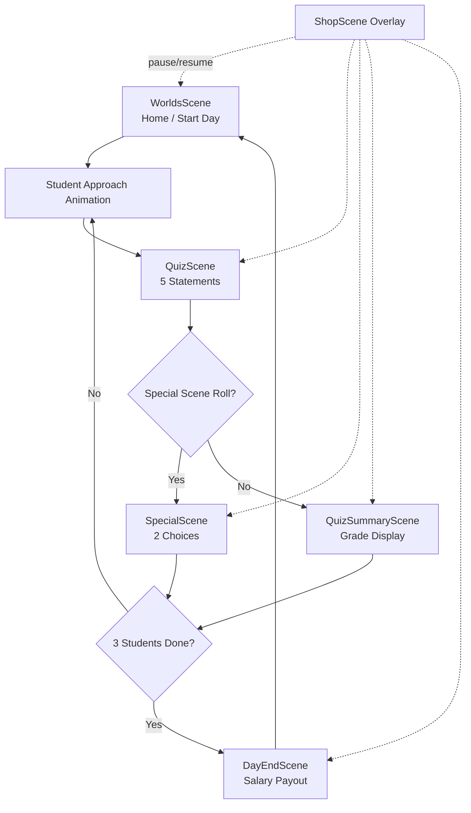

# Professor, Please!
## Game Design Document (GDD)

**Version:** 1.0 (as implemented)  
**Engine:** Phaser 3.90 + Vite 7  
**Platforms:** Web (GitHub Pages, CrazyGames)  
**Orientation:** Portrait (1080×1920)  
**Genre:** Quiz / Career Sim / Light Narrative  
**Live URL:** https://sinsonic.github.io/ProfessorPlease/

---

## 1. Executive Summary

### 1.1 High Concept
You are a university professor grading student exams. Each student presents **5 factual statements** — you judge each as **CORRECT** or **NOT CORRECT**. Your accuracy builds **Academic Reputation**, which determines your **daily salary**. After grading, students may confront you in **special post-exam scenes** where moral choices affect reputation and money. Spend earnings in the **Faculty Shop** on office decorations and next-day boosters.

### 1.2 Elevator Pitch
*"Papers, Please! meets university life — swipe to grade facts, survive student drama, and climb from Disgraced Scholar to Legendary Academic."*

### 1.3 Design Pillars
1. **Fast, tactile grading** — swipe or tap; immediate feedback per statement
2. **Meaningful trade-offs** — reputation vs. money in special scenes
3. **Career progression** — salary tiers, savings, visible office upgrades
4. **Replayable narrative beats** — 13 special scenes triggered by grade + RNG
5. **Session-friendly loop** — 3 students per day, clear day boundaries

### 1.4 Target Audience
- Casual web/mobile players (5–15 min sessions)
- Trivia / fact-checking fans
- Players who enjoy moral-choice vignettes (Papers Please, Reigns-style dilemmas)
- Ages 12+ (academic themes, mild ethical dilemmas, no violence)

---

## 2. Core Gameplay Loop

### 2.1 Macro Loop (Career)
```
START → Work Day (3 students) → Payday → Shop (optional) → Next Day → repeat indefinitely
```

### 2.2 Micro Loop (Single Student)
```
Student approaches → 5 statements graded → Grade assigned (A–F)
  → [Optional] Special Scene OR Grade Summary
  → Next student OR End Work Day
```

### 2.3 Scene Flow Diagram



### 2.4 Session Structure

| Parameter | Value |
|-----------|-------|
| Students per work day | **3** |
| Statements per student | **5** |
| Total statements per day | **15** |
| Day counter | Starts at **Day 1**, increments after payday |
| End condition | None (infinite career) |

---

## 3. Grading System (QuizScene)

### 3.1 Objective
For each of 5 statements, determine whether the claim is factually correct.

### 3.2 Input Methods

| Method | Action |
|--------|--------|
| **Swipe left** | NOT CORRECT (threshold: 150px drag) |
| **Swipe right** | CORRECT |
| **Tap NOT CORRECT button** | Left pink button (`#dc6c86`) |
| **Tap CORRECT button** | Right teal button (`#2b9f89`) |
| **Post-answer review** | Tap card or swipe to advance to next statement |

### 3.3 Statement Card UX
- Card stack visual (shadow layers, cream `#fffdf7` card)
- Font size scales by length: **40px** (≤60 chars), **34px** (default), **28px** (≥130 chars)
- After answer: card flips to green (correct) or red (wrong) with **explanation** text
- Card flies off-screen when advancing

### 3.4 Feedback Systems

| Event | Visual/Audio Feedback |
|-------|----------------------|
| Correct answer | Green screen flash, `+1 🔥` float, 7 particle burst, card bounce |
| Wrong answer | Pink screen flash, card shake (3 yoyo, 12px) |
| Reputation change | Applied **immediately** per statement (not at exam end) |

### 3.5 Grading Scale

| Correct Answers (of 5) | Letter Grade |
|------------------------|--------------|
| 5 | **A** |
| 4 | **B** |
| 3 | **C** |
| 2 | **D** |
| 0–1 | **F** |

> Note: Both 0 and 1 correct map to **F**.

### 3.6 Reputation Per Statement

| Result | Base Reputation Change |
|--------|------------------------|
| Correct | **+1** |
| Wrong | **−1** |

Modifiers (boosters) apply on top — see Section 5.

### 3.7 Student Pool

- **13 students** in `students.json`
- Selected via **random shuffle** (no duplicate prevention)
- Each student has exactly **5 statements** with `statement`, `isCorrect`, `explanation`
- Invalid entries (≠5 statements) are filtered out at load time

#### Student Roster

| ID | Name | Major |
|----|------|-------|
| student_001 | Alex Novak | Physics |
| student_002 | Mina Lee | Computer Science |
| student_003 | Diego Silva | History |
| student_004 | Emma Kowalski | Biology |
| student_005 | Raj Patel | Chemistry |
| student_006 | Sofia Bergström | Astronomy |
| student_007 | James Okafor | Geography |
| student_008 | Yuki Tanaka | Psychology |
| student_009 | Carlos Mendez | Engineering |
| student_010 | Ingrid Holm | Medicine |
| student_011 | Liam O'Connor | Literature |
| student_012 | Amara Diallo | Economics |
| student_013 | Noah Weiss | Mathematics |

**Total content pool:** 65 unique fact statements across all majors.

---

## 4. Special Post-Exam Scenes

### 4.1 Purpose
After each student exam, optional narrative encounters add **moral dilemmas** that modify reputation and money beyond pure grading.

### 4.2 Trigger Algorithm
1. Compute letter grade from `correctCount`
2. Filter scenes where `grades` array includes that grade
3. Each eligible scene rolls independently: `random(0–100) < chance`
4. If **no scenes pass** → go to `QuizSummaryScene`
5. If **one or more pass** → weighted random pick (weight = each scene's `chance` value)

### 4.3 Template: Confrontation
All 13 scenes use `template: "confrontation"`:

1. Banner with grade context
2. Student walks in (1300ms)
3. Student dialogue bubble
4. Optional prop appears (`envelope` or `gift`)
5. 1600ms pause
6. Professor prompt + **2 choice buttons**
7. Choice → student reply → professor reply → outcome text + effect summary
8. Choice animation plays
9. 900ms delay → **CONTINUE** button

### 4.4 Choice Button Colors

| Color Key | Meaning | Typical Use |
|-----------|---------|-------------|
| `accept` | Compliant / lenient / risky | Green-teal tone |
| `reject` | Firm / ethical refusal | Red-pink tone |
| `neutral` | Professional middle ground | Gray-blue tone |

### 4.5 Animation Types

| Animation | Behavior |
|-----------|----------|
| `none` | Static figures |
| `accept_bribe` | Envelope slides toward professor |
| `accept_gift` | Gift fades toward professor |
| `kick_out` | Student exits left (−220px), tilted |
| `student_leaves` | Student exits right (1180px), fades |

### 4.6 Text Interpolation Tokens

| Token | Resolves To |
|-------|-------------|
| `{studentName}` | Current student name |
| `{studentMajor}` | Major string |
| `{majorSuffix}` | ` (Major)` or empty |
| `{grade}` | A–F |
| `{correctCount}` | 0–5 |
| `{total}` | 5 |
| `{result}` | e.g. `3/5` |

### 4.7 Complete Special Scene Catalog

#### The Bribe (`bribe_attempt`)
- **Grades:** D, F | **Chance:** 20% | **Prop:** envelope
- **ACCEPT:** Rep −10, Money +$120, animation: accept_bribe, grade display adjusted to C
- **KICK OUT:** Rep +3

#### Scholarship on the Line (`scholarship_plea`)
- **Grades:** C | **Chance:** 30%
- **EXTRA CREDIT:** Rep +2
- **STAND FIRM:** Rep +1, student_leaves

#### Thank-You Gift (`celebration_gift`)
- **Grades:** A | **Chance:** 30% | **Prop:** gift
- **ACCEPT GIFT:** Rep −2, Money +$25, accept_gift
- **POLITELY DECLINE:** Rep +4, student_leaves

#### The Regrade Request (`grade_dispute`)
- **Grades:** B | **Chance:** 45%
- **REGRADE:** Rep −1
- **HOLD GRADE:** Rep +2, student_leaves

#### The Parent Email (`parent_pressure`)
- **Grades:** D, F | **Chance:** 35%
- **BUMP GRADE:** Rep −6
- **REFUSE & LOG:** Rep +4, student_leaves

#### The Cheating Tip (`cheating_witness`)
- **Grades:** C, D | **Chance:** 40%
- **INVESTIGATE:** Rep +5
- **DROP IT:** Rep −3, student_leaves

#### The Extension Plea (`extension_plea`)
- **Grades:** B, C | **Chance:** 50%
- **GRANT EXTENSION:** Rep +2
- **NO EXTENSION:** Rep +1, student_leaves

#### The RA Offer (`research_assistant`)
- **Grades:** A, B | **Chance:** 30%
- **HIRE & BUMP:** Rep −5
- **HIRE FAIRLY:** Rep +3, student_leaves

#### The Dean Threat (`dean_complaint`)
- **Grades:** F | **Chance:** 55%
- **COMPROMISE:** Rep −7
- **STAND GROUND:** Rep +5, kick_out

#### The Exam Leak (`exam_leak`)
- **Grades:** B, C | **Chance:** 25% | **Prop:** envelope
- **REPORT LEAK:** Rep +6
- **IGNORE IT:** Rep −4, student_leaves

#### The Coffee Deal (`coffee_bribe`)
- **Grades:** A, B | **Chance:** 35% | **Prop:** gift
- **ACCEPT DEAL:** Rep −3, Money +$15, accept_gift
- **DECLINE:** Rep +2, student_leaves

#### The Impostor (`impostor_exam`)
- **Grades:** D, F | **Chance:** 20%
- **VERIFY ID:** Rep +3
- **DISMISS:** Rep −2, kick_out

#### The Donation Hint (`donation_hint`)
- **Grades:** C, D | **Chance:** 15% | **Prop:** envelope
- **ADJUST GRADE:** Rep −8, Money +$200, accept_bribe
- **REFUSE:** Rep +6, kick_out

### 4.8 Special Scene Design Notes
- Scene-level `reputationChange` / `moneyChange` are **0 for all scenes** — effects come entirely from choices
- Special scenes **bypass** `QuizSummaryScene` (no grade summary screen)
- `happytime()` (CrazyGames) does **not** fire on A-grade special scenes — only on `QuizSummaryScene`
- Multiple scenes can trigger same roll window (e.g. F grade: bribe 20%, parent 35%, dean 55%, impostor 20%)

---

## 5. Career & Economy

### 5.1 Persistent State (`localStorage`: `professor_career_v1`)

| Field | Default | Description |
|-------|---------|-------------|
| `reputation` | 0 | Integer, unbounded |
| `money` | 0 | Savings in dollars |
| `day` | 1 | Current calendar day |
| `studentsGradedToday` | 0 | 0–3 counter |
| `ownedDecorations` | `[]` | Permanent shop purchases |
| `pendingBoosters` | `[]` | Bought, activate next work day |
| `activeBoosters` | `[]` | Active during current work day |
| `mistakeShieldUsed` | false | Shield consumed flag |

### 5.2 Salary Tiers (`salaryMatrix.json`)

| Reputation Range | Academic Title | Daily Base Salary |
|------------------|----------------|-------------------|
| ≤ −20 | Disgraced Scholar | **$5** |
| −19 to 0 | On Probation | **$9** |
| 1 to 15 | Assistant Professor | **$10** |
| 16 to 35 | Associate Professor | **$30** |
| 36 to 60 | Department Star | **$60** |
| ≥ 61 | Legendary Academic | **$100** |

### 5.3 Payday Flow (`DayEndScene`)
1. Look up salary tier from **current reputation**
2. Calculate payout: `round(baseSalary × salaryMultiplier)`
3. Add payout to `money`
4. Reset `studentsGradedToday` to 0
5. Increment `day`
6. Clear `activeBoosters`

> **UI quirk:** Screen shows **base** salary; wallet receives multiplied amount. Booster bonus line shows multiplier % separately.

### 5.4 Booster System

#### Activation
- Triggered on **START WORK DAY** or **CONTINUE DAY** from home screen
- `pendingBoosters` → `activeBoosters`, pending cleared
- `mistakeShieldUsed` reset
- `day_start_money` applied immediately (e.g. Coffee Stash +$50)

#### Expiry
- Cleared at payday
- Salary multiplier applies only to that day's payout

#### Booster Catalog

| Item | Price | Effect | Value |
|------|-------|--------|-------|
| Reputation Charm | $120 | `rep_bonus` | +1 rep per correct answer |
| Salary Negotiator | $180 | `salary_multiplier` | ×1.25 payday |
| Mistake Shield | $150 | `mistake_shield` | First wrong answer costs 0 rep |
| Coffee Stash | $90 | `day_start_money` | +$50 at day start |

#### Booster Rules
- Only **one purchase per booster ID** per day cycle (pending OR active blocks re-buy)
- Mid-day shop purchase goes to `pendingBoosters` — won't activate until **next** work day
- Mistake Shield: single use per day; flag set after first protected wrong answer

### 5.5 Economic Balance Snapshot

| Income Source | Typical Range |
|---------------|---------------|
| Daily salary | $5–$100 |
| Special scenes | −$0 to +$200 per choice |
| Coffee Stash booster | +$50 once per day |
| Shop decorations | $60–$350 one-time |

| Expense | Range |
|---------|-------|
| Decorations | $60–$350 |
| Boosters | $90–$180 per day |

---

## 6. Faculty Shop

### 6.1 Access
- **Always available** via green **$ SHOP** icon (bottom-right, ~980×1840)
- Present on: Home, Quiz, Summary, Special Scene, Payday
- Opens as **overlay** (`ShopScene`); parent scene **paused**
- **EXIT** button (bottom-left) resumes parent and refreshes classroom decorations

### 6.2 Tabs
1. **DECORATIONS** — permanent office items
2. **BOOSTERS** — next-day consumables

### 6.3 Decoration Catalog

| Item | Price | Key | Placement |
|------|-------|-----|-----------|
| Desk Plant | $80 | `desk_plant` | Desk right (~x880) |
| Framed Diploma | $150 | `wall_diploma` | Back wall, "PhD" frame |
| Brass Desk Lamp | $100 | `desk_lamp` | Desk left (~x220) |
| Persian Rug | $200 | `floor_rug` | Floor ellipse (~y1680) |
| Teaching Trophy | $350 | `gold_trophy` | Desk left (~x280) |
| Motivational Poster | $60 | `motivational_poster` | Wall, "READ MORE BOOKS" |

### 6.4 Purchase States

| Button Label | Condition |
|--------------|-----------|
| BUY | Affordable, not owned |
| OWNED | Decoration already purchased |
| READY | Booster already pending/active |
| TOO POOR | Insufficient funds |

### 6.5 Decoration Rendering
- Drawn on dedicated `decorLayer` above classroom furniture
- Persist across all scenes via `ownedDecorations` in career save
- Refreshed when exiting shop overlay

---

## 7. Scenes & UI Reference

### 7.1 WorldsScene (Home)
- Logo: **"PROFESSOR, PLEASE!"**
- Career panel: Reputation + Savings
- CTA: `START WORK DAY` or `CONTINUE DAY (X/3)`
- Student approach animation before first/mid-day quiz
- Classroom: 3 papers on desk

### 7.2 QuizScene
- HUD: `Exam N/5 • StudentName`, `Correct: X/5`
- Career HUD bar (top)
- Status: "Choose CORRECT or NOT CORRECT"
- Helper: "Swipe left or right"
- Classroom: 2 papers
- `gameplayStart()` on enter, `gameplayStop()` after 5th statement

### 7.3 QuizSummaryScene
- Large grade letter display (A–F)
- Per-statement result breakdown
- CTA: `NEXT STUDENT` or `END WORK DAY`
- `happytime()` on grade **A** only
- Classroom: 4 papers

### 7.4 SpecialScene
- Professor figure (brown suit, glasses) + student figure (blue, backpack)
- Speech bubbles with directional tails
- 2 large choice buttons
- Classroom: 5 papers

### 7.5 DayEndScene
- "End of Work Day" header
- Rank title, salary earned, reputation, total savings
- Booster multiplier line (if applicable)
- **CONTINUE** → home
- Classroom: 2 papers

### 7.6 Career HUD (All Main Scenes)

```
┌─────────────────────────────────────────────────────┐
│ Day 2          [████████░░░░] Students: 1/3    $25 │
│ Academic reputation: 16                             │
└─────────────────────────────────────────────────────┘
```

- Bar fill turns **amber** at 3/3 students
- Money displayed in teal (`#2b9f89`)

### 7.7 Color Palette

| Element | Color |
|---------|-------|
| Wall | `#e9dcc8` |
| Floor | `#c9a66b` |
| Chalkboard | `#1f4d3a` |
| Primary CTA / Correct | `#2b9f89` |
| Wrong / Reject | `#dc6c86` / `#e35d7a` |
| Text primary | `#1e2b57` |
| Text secondary | `#64748b` |
| Card background | `#fffdf7` |

---

## 8. Classroom & Characters

### 8.1 Environment
- Fixed exam hall set: chalkboard ("EXAM HALL"), two windows, professor desk (720×120 at y=1540), chair silhouette
- Procedural paper stacks vary by scene (1–5 sheets)

### 8.2 Student Approach Sequence
1. Student enters from right (x=1120)
2. Walks to desk (~1400ms)
3. Drops 5 animated papers onto desk
4. Status text: "Papers delivered!" + student name/major
5. Transitions to `QuizScene`
6. **6-second safety timeout** forces completion

### 8.3 Character Designs (Vector/Primitive)
- **Student:** Blue body, brown hair, backpack, held papers
- **Professor:** Brown suit, red tie, glasses (special scenes only)
- **Props:** Envelope with `$` mark; wrapped gift box

---

## 9. Audio & Music

**Current state:** No dedicated audio system implemented.

**Recommendation for v2:** Subtle SFX for correct/wrong swipe, paper shuffle, shop purchase chime, day-end cash register.

---

## 10. Technical Specification

### 10.1 Stack

| Layer | Technology |
|-------|------------|
| Game engine | Phaser 3.90 |
| Build tool | Vite 7.1 |
| Language | JavaScript (ES modules) |
| Data | JSON (`public/data/`) |
| Persistence | `localStorage` |
| Unused deps | `papaparse` (CSV parser, not wired) |

### 10.2 Resolution & Scaling
- Native: **1080×1920** portrait
- Scale mode: `Phaser.Scale.FIT` + `CENTER_BOTH`
- Parent element: `#app` (full viewport, no scroll)

### 10.3 Data Files

| File | Purpose |
|------|---------|
| `students.json` | 13 students × 5 statements |
| `specialScenes.json` | 13 confrontation scenes |
| `shop.json` | 10 shop items |
| `salaryMatrix.json` | 6 salary tiers |
| `questions.csv` | Legacy/unused |

### 10.4 Scene Registry
`WorldsScene`, `QuizScene`, `QuizSummaryScene`, `SpecialScene`, `DayEndScene`, `ShopScene`

### 10.5 Deployment

| Target | Build Command | Base Path |
|--------|---------------|-----------|
| GitHub Pages | `npm run build:pages` | `/ProfessorPlease/` |
| CrazyGames | `npm run build` | `./` (relative) |
| Local dev | `npm start` | `/` → `index.source.html` |

CI workflow on `main` push rebuilds and commits `index.html`, `assets/`, `data/`, `docs/`.

### 10.6 CrazyGames SDK
- Activates only on `*.crazygames.com` hostnames
- `SDK.init()` with 5s timeout; failures are non-fatal
- Hooks: `gameplayStart`, `gameplayStop`, `happytime` (A grade only)

---

## 11. Progression Curve (Design Intent)

### 11.1 Early Game (Days 1–3)
- Reputation swings ±15 per day from grading alone
- Salary: $9–$10 range
- First decoration achievable after ~1–2 good days
- Special scenes introduce moral pressure early

### 11.2 Mid Game (Days 4–10)
- Reputation stabilizes if player grades accurately
- Associate Professor tier ($30/day) reachable around rep 16
- Boosters become affordable; decoration collection begins

### 11.3 Late Game (Day 10+)
- Department Star / Legendary tiers ($60–$100/day)
- Full office decoration set ~$940 total
- Special scene choices matter less economically but affect reputation swings

### 11.4 Failure Spiral
- Wrong answers stack: 15 wrong in a day = −15 rep
- Disgraced Scholar tier ($5/day) at rep ≤ −20
- Recovery requires consistent correct grading or ethical special scene choices

---

## 12. Known Gaps & Future Opportunities

| Gap | Notes |
|-----|-------|
| No in-game reset | `resetCareer()` exists, no UI |
| Orphaned `progressStore` | `bestStreak`, quiz stats never updated |
| No duplicate student prevention | Same student can appear twice per day |
| No audio | Silent experience |
| `isFailingGrade()` unused | Could gate unique F-grade content |
| Salary UI vs payout mismatch | Display shows base, not multiplied |
| Mid-day booster timing | Purchased boosters won't help current day |
| Infinite career only | No win/lose end state |
| 13 students vs infinite days | Content repetition inevitable |

### 12.1 Recommended v2 Features
1. **New student packs** by department
2. **Semester goals** (reach Legendary by Day 30)
3. **Department events** (budget cuts, accreditation visit)
4. **Achievement system** tied to `progressStore`
5. **Sound design** pass
6. **Student memory** — track who appeared recently
7. **Prestige / New Game+** after N days as Legendary

---

## 13. Content Summary

| Category | Count |
|----------|-------|
| Playable scenes | 6 (+ shop overlay) |
| Students | 13 |
| Fact statements | 65 |
| Special scenes | 13 |
| Shop items | 10 (6 decor + 4 boosters) |
| Salary tiers | 6 |
| Grade letters | 6 (A–F) |
| Booster types | 4 |
| Decoration keys | 6 |
| Choice animations | 5 |

---

## 14. Glossary

| Term | Definition |
|------|------------|
| **Statement** | Single true/false factual claim in an exam |
| **Work Day** | Block of 3 student exams before payday |
| **Reputation** | Core skill/integrity metric affecting salary tier |
| **Special Scene** | Post-exam narrative encounter with 2 choices |
| **Booster** | Single-day shop consumable activated at next work day start |
| **Decoration** | Permanent cosmetic office upgrade |
| **Confrontation** | Special scene template with student-professor dialogue |
